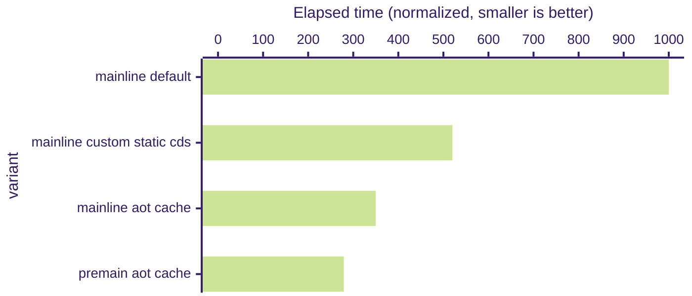
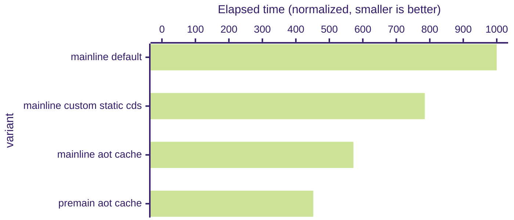
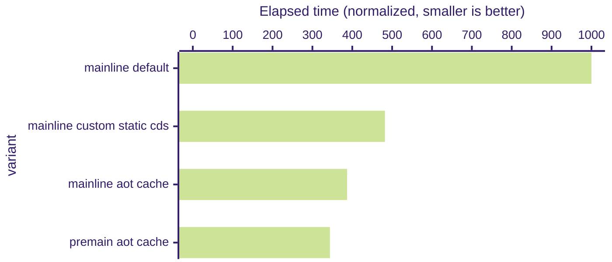
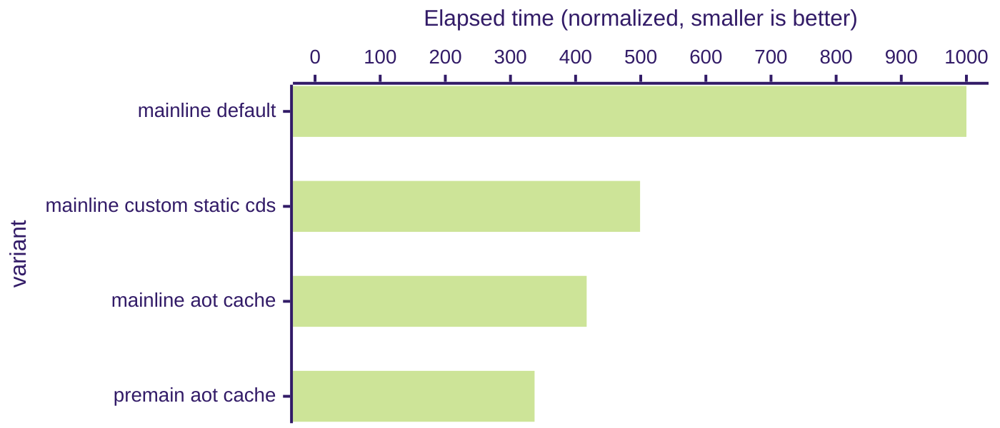
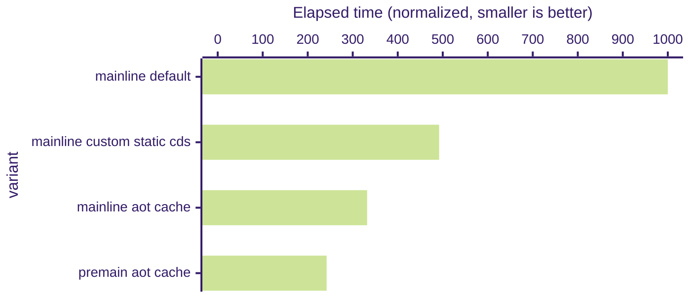
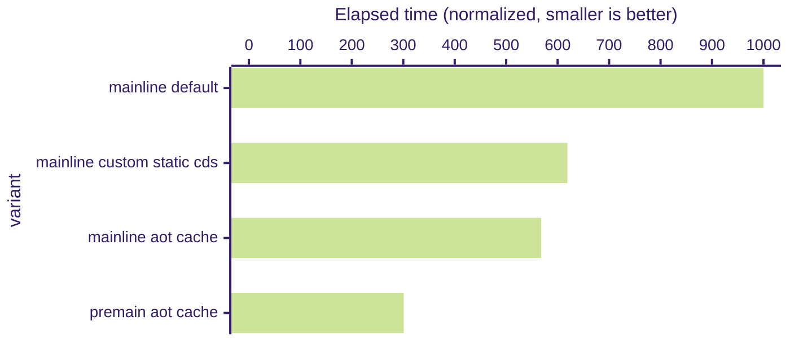

# Welcome to the Leyden Prototype Repository

The purpose of the Leyden repository is to prototype improvements to
the startup time, time to peak performance, and footprint of Java programs, as a part of
[Project Leyden](https://openjdk.org/projects/leyden). We solicit feedback from
the Java community, with the hope that some of these improvements can eventually be
incorporated into future JDK releases.

## 0. Disclaimers

- *This repository contains experimental and unstable code. It is not intended to be used
   in a production environment.*
- *This repository is intended for developers of the JDK, and advanced Java developers who
   are familiar with building the JDK.*
- *The experimental features in this repository may be changed or removed without notice.
   Command line flags and workflows will change.*
- *The benchmarks results reported on this page are for illustrative purposes only. Your
   applications may get better or worse results.*

To try out the Leyden prototype without building it from source code, please download the
Leyden EA Release from [https://jdk.java.net/leyden/](https://jdk.java.net/leyden/).

## 1. Overview

As of JDK 25, the Leyden Project has successfully delivered ahead-of-time (AOT)
optimizations JEPs:

- [JEP 483 - Ahead-of-Time Class Loading & Linking](https://openjdk.org/jeps/483)
- [JEP 514 - Ahead-of-Time Command-Line Ergonomics](https://openjdk.org/jeps/514)
- [JEP 515 - Ahead-of-Time Method Profiling](https://openjdk.org/jeps/515)

Please refer to the above JEPs for a detailed discussion of AOT optimizations.

The Leyden "[premain](https://github.com/openjdk/leyden/blob/premain/)" prototype
includes new experimental AOT optimizations that are not yet integrated into the JDK mainline:

- **[Ahead-of-Time Code Compilation (JEP draft 8335368)](https://openjdk.org/jeps/8335368)**: Methods that are frequently used during the training run can be
  compiled and stored along with the AOT cache. As a result, as soon as the application starts up
  in the production run, its methods can be natively executed.
  - This feature is enabled by default when you create an AOT cache. It can be disabled with the diagnostic
    flag `-XX:-AOTCodeCaching`.

- **Ahead-of-time generation of [Dynamic Proxies](https://docs.oracle.com/en/java/javase/22/docs/api/java.base/java/lang/reflect/Proxy.html)**:
  Dynamic proxies are frequently used by popular application frameworks. We can improve start-up time by generating these proxies ahead of time.
  - This feature is enabled by default when you create an AOT cache. It can be disabled with the diagnostic
    flag `-XX:-ArchiveDynamicProxies`.

- **Ahead-of-time generation of reflection data**: Reflection data (such as instances of
  `java.lang.reflect.Method`) are generated by the JVM to support `java.lang.reflect` operations. We can
  generate these ahead of time to improve start-up.
  - This feature is enabled by default when you create an AOT cache. It can be disabled with the diagnostic
    flag `-XX:-ArchiveReflectionData`.

- **Class Not Found Cache**: Sometimes application frameworks repeatedly try to load classes that do not exist. This optimization allows such failing lookups to be done quickly without repeatedly scanning the class path.
  - This feature is enabled by default when you create an AOT cache. It can be disabled with the diagnostic
    flag `-XX:-ArchiveLoaderLookupCache`.

## 2. Building the Leyden Repository

The Leyden Repository can be built in the same way as the main-line JDK repository.
Please use the "premain" branch. I.e., [https://github.com/openjdk/leyden/tree/premain](https://github.com/openjdk/leyden/tree/premain).

For build instructions please see the
[online documentation](https://openjdk.org/groups/build/doc/building.html),
or either of these files:

- [doc/building.html](doc/building.html) (html version)
- [doc/building.md](doc/building.md) (markdown version)

See <https://openjdk.org/> for more information about the OpenJDK
Community and the JDK and see <https://bugs.openjdk.org> for JDK issue
tracking.

## 3. Trying out Leyden Features

The easiest way to try out the Leyden optimizations is to build a JVM from the Leyden repository, and use it with your application with the `-XX:AOTCache` flag.


Here's a small benchmark that uses the JDK's built-in
[`JavaCompiler`](https://docs.oracle.com/en/java/javase/21/docs/api/java.compiler/javax/tools/JavaCompiler.html)
class to compile some Java source files. This benchmark spends a significant amount of start-up time
setting up the classes used by `JavaCompiler`, so it will benefit from the Leyden features.

First, download [JavacBenchApp.java](test/setup_aot/JavacBenchApp.java) and compile it into a JAR file.

(Remember to use the `java` program that you built from the Leyden repository.)

```
$ javac JavacBenchApp.java
$ jar cvf JavacBenchApp.jar JavacBenchApp*.class
added manifest
adding: JavacBenchApp$ClassFile.class(in = 1608) (out= 787)(deflated 51%)
adding: JavacBenchApp$FileManager.class(in = 2090) (out= 979)(deflated 53%)
adding: JavacBenchApp$SourceFile.class(in = 1351) (out= 671)(deflated 50%)
adding: JavacBenchApp.class(in = 7571) (out= 3302)(deflated 56%)
```

We can run this benchmark without any AOT optimizations. It takes 893 ms:

```
$ java -cp JavacBenchApp.jar JavacBenchApp 50
Generated source code for 51 classes and compiled them in 893 ms
```

To use AOT optimizations for JavacBenchApp, we should first perform a _training run_ and
capture the profiling information into `JavacBenchApp.aotconfig`

```
$ java -XX:AOTMode=record -XX:AOTConfiguration=JavacBenchApp.aotconfig \
       -cp JavacBenchApp.jar JavacBenchApp 50
$ ls -l JavacBenchApp.aotconfig
-rw-rw-r-- 1 iklam iklam 27652096 Mar  3 16:23 JavacBenchApp.aotconfig
```

With the `JavacBenchApp.aotconfig` file, we can create the AOT cache. This is called the _assembly phase_:

```
$ java -XX:AOTMode=create -XX:AOTConfiguration=JavacBenchApp.aotconfig \
       -cp JavacBenchApp.jar -XX:AOTCache=JavacBenchApp.aot
$ ls -l JavacBenchApp.aot
-r--r--r-- 1 iklam iklam 42332160 Mar  3 16:58 JavacBenchApp.aot
```

Alternatively, you can also combine the training run and assembly phase with a single command:

```
$ java -XX:AOTCacheOutput=JavacBenchApp.aot \
       -cp JavacBenchApp.jar JavacBenchApp 50
$ ls -l JavacBenchApp.aot
-r--r--r-- 1 iklam iklam 42332160 Mar  3 16:58 JavacBenchApp.aot
```

Now, we can make a _production run_ of the program using the AOT cache `JavacBenchApp.aot`. It finishes in 423 ms, or more than twice as fast as
before.

```
$ java -XX:AOTCache=JavacBenchApp.aot -cp JavacBenchApp.jar JavacBenchApp 50
Generated source code for 51 classes and compiled them in 423 ms
```

### Ending the Training Run Early

By default, training runs end when the application terminates.  You have two other options to end training runs:

- `-XX:AOTEndTrainingOnMethodEntry=<method1,method2,...>[,count=100]`
- `jcmd <pid> AOT.end_training`

Note that `-XX:AOTEndTrainingOnMethodEntry` uses the same format as `-XX:CompileOnly` and the default count is 1.

See [EndTrainingOnMethodEntry.java](test/hotspot/jtreg/runtime/cds/appcds/leyden/EndTrainingOnMethodEntry.java) for a test case.

### Diagnosing Potential Performance Issues

As mentioned below, parts or all of the AOT cache may be disabled under certain circumstances. This may lead
to lower performance than expected. To diagnose potential performance issues, you can add `-Xlog:aot*` to the
command line to see detailed information about what parts of the AOT cache are being utilized. For example, if the
the AOT-compiled code cannot be loaded, you will see a log message like this:

```
[0.008s][info][aot,codecache,init] Mapped 652184 bytes at address 0x00007f491005f028 from AOT Code Cache
[0.008s][info][aot,codecache,init] Loaded 439 AOT code entries from AOT Code Cache
[0.008s][info][aot,codecache,init] Unable to use AOT Code Cache.
```

### Diagnostic VM Flags

By default, all of the optimizations described
in the [Overview](#1-overview) section above are enabled by default. This ensures that you can get all the optimizations
without specifying them individually.

For diagnostic purposes, you can selectively disable some of the options:

- The `-XX:+AOTCodeCaching` flag affects only the assembly phase and the production run.
- The `-XX:+AOTRecordTraining` flag affects only the training run and the assembly phase.
- The `-XX:+AOTReplayTraining` flag affects only the production run.
- All other options affect only the assembly phase.

For example, you can disable the loading of AOT-compiled methods during the production run. Notice that the benchmark now
starts more slowly than it did when AOT-compiled methods was loaded.

```
$ java -XX:AOTCache=JavacBenchApp.aot -Xlog:cds=error -XX:-AOTCodeCaching \
       -cp JavacBenchApp.jar JavacBenchApp 50
Generated source code for 51 classes and compiled them in 647 ms
```

You can also disable AOT compilation in the assembly phase. Note that the size of the AOT
cache is smaller because it no longer has AOT-compiled methods.

```
$ java -XX:AOTMode=create -XX:AOTConfiguration=JavacBenchApp.aotconfig \
       -cp JavacBenchApp.jar \
       -XX:AOTCache=JavacBenchApp.aot -XX:-AOTCodeCaching
$ ls -l JavacBenchApp.aot
-r--r--r-- 1 iklam iklam 29990912 Mar  3 16:34 JavacBenchApp.aot
```


## 4. Limitations of the Leyden Prototype

When trying out the Leyden prototype, please pay attention to the following limitations.

### The Same CPU Must be Used between Training and Production Runs

The AOT-compiled code will be only used if the production run is on a machine with the same type of CPU
as used in the training run and assembly phase. If this is not the case (for example, the production run is on
a machine that has different AVX capabilities), the AOT-compiled code will be ignored.


### The Same Garbage Collector Must be Used between Training and Production Runs

The AOT cache generated by the Leyden prototype includes machine instructions that are specific to
the garbage collector. We recommend that you explicitly specify the same collector during both
training and production runs. For example, if you prefer to use the SerialGC:

```
# assembly phase.
$ java -XX:AOTMode=create -XX:AOTConfiguration=JavacBenchApp.aotconfig \
       -cp JavacBenchApp.jar \
       -XX:AOTCache=JavacBenchApp.aot -XX:+UseSerialGC

# production run
$ java -XX:AOTCache=JavacBenchApp.aot -XX:+UseSerialGC -cp JavacBenchApp.jar \
       JavacBenchApp 50
```

Otherwise, the AOT cache may not be usable for the production run, leading to suboptimal performance.
For example, sometimes you may perform the assembly phase run on a large development host, and then use
a container to run the application in a small production node. In the following scenario, as the collector
is not explicitly specified, the VM will automatically pick G1 for the assembly phase, and SerialGC for the
production run (due to its limited amount of memory):

```
# Assembly phase (uses G1 by default)
$ java -XX:AOTMode=create -XX:AOTConfiguration=JavacBenchApp.aotconfig \
       -cp JavacBenchApp.jar -XX:AOTCache=JavacBenchApp.aot

# Production run (uses SerialGC)
$ docker run --rm -v /repos/leyden/build/linux-x64/images/jdk:/jdk -v $(pwd):/test \
    --memory=1024m \
    container-registry.oracle.com/java/openjdk \
    bash -c 'cd /test; ' \
            '/jdk/bin/java -XX:AOTCache=JavacBenchApp.aot ' \
            '    -cp JavacBenchApp.jar JavacBenchApp 50'
[0.001s][error][aot] AOT cache has aot-linked classes. It cannot be used because
                     GC used during dump time (G1) is not the same as runtime (Serial)
[0.001s][error][aot] An error has occurred while processing the AOT cache.
[0.001s][error][aot] Unable to map shared spaces
Error occurred during initialization of VM
Unable to use AOT cache.
```

### Only G1GC, SerialGC, ParallelGC, EpsilonGC, ShenandoahGC are Supported

Currently, if you use any other garbage collector in combination with `-XX:AOTMode` or `-XX:AOTCache`, the VM will
exit with an error.

```
$ java -XX:AOTMode=record -XX:AOTConfiguration=JavacBenchApp.aotconfig \
       -cp JavacBenchApp.jar -XX:+UseZGC JavacBenchApp 50
Error occurred during initialization of VM
Cannot create the AOT configuration file: UseCompressedClassPointers must be enabled,
and collector must be G1, Parallel, Serial, Epsilon, or Shenandoah
```

## 5. Benchmarking

We use a small set of benchmarks to demonstrate the performance of the optimizations in the Leyden repo.

| Benchmark  | Source |
| ------------- | ------------- |
|[helidon-quickstart-se](test/hotspot/jtreg/premain/helidon-quickstart-se) | https://helidon.io/docs/v4/se/guides/quickstart|
|[javac-bench](test/hotspot/jtreg/premain/javac_bench) | Using Javac to compile 50 source files |
|[micronaut-first-app](test/hotspot/jtreg/premain/micronaut-first-app) | https://guides.micronaut.io/latest/creating-your-first-micronaut-app-maven-java.html|
|[quarkus-getting-started](test/hotspot/jtreg/premain/quarkus-getting-started) | https://quarkus.io/guides/getting-started|
|[spring-boot-getting-started](test/hotspot/jtreg/premain/spring-boot-getting-started) | https://spring.io/guides/gs/spring-boot|
|[spring-petclinic](test/hotspot/jtreg/premain/spring-petclinic) | https://github.com/spring-projects/spring-petclinic|

### Benchmarking Against JDK Main-line

To can compare the performance of Leyden vs the main-line JDK, you need:

- An official build of JDK 21
- An up-to-date build of the JDK main-line
- The latest Leyden build
- Maven (ideally 3.8 or later, as required by some of the demos). Note: if you are behind
  a firewall, you may need to [set up proxies for Maven](https://maven.apache.org/guides/mini/guide-proxies.html)

The same steps are used for benchmarking all of the above demos. For example:

```
$ cd test/hotspot/jtreg/premain/helidon-quickstart-se
$ make PREMAIN_HOME=/repos/leyden/build/linux-x64/images/jdk \
       MAINLINE_HOME=/repos/jdk/build/linux-x64/images/jdk \
       BLDJDK_HOME=/usr/local/jdk21 \
       bench
run,mainline default,mainline custom static cds,mainline aot cache,premain aot cache
1,456,229,156,117
2,453,227,157,117
3,455,232,155,116
4,448,230,154,114
5,440,228,156,114
6,446,228,156,114
7,448,232,156,114
8,465,261,159,114
9,448,226,157,113
10,442,233,154,114
Geomean,450.05,232.41,155.99,114.69
Stdev,6.98,9.72,1.41,1.35
Markdown snippets in mainline_vs_premain.md
```

The above command runs each configuration 10 times, in an interleaving order. This way
the noise of the system (background processes, thermo throttling, etc) is more likely to
be spread across the different runs.

As is typical for benchmarking start-up performance, the numbers are not very steady.
It is best to plot
the results (as saved in the file `mainline_vs_premain.csv`) in a spreadsheet to check for
noise and other artifacts.

The "make bench" target also generates GitHub markdown snippets (in the file `mainline_vs_premain.md`) for creating the
graphs below.

### Benchmarking Between Two Leyden Builds

This is useful for Leyden developers to measure the benefits of a particular optimization.
The steps are similar to above, but we use the "make compare_premain_builds" target:

```
$ cd helidon-quickstart-se
$ make PM_OLD=/repos/leyden_old/build/linux-x64/images/jdk \
       PM_NEW=/repos/leyden_new/build/linux-x64/images/jdk \
       BLDJDK_HOME=/usr/local/jdk21 \
       compare_premain_builds
Old build = /repos/leyden_old/build/linux-x64/images/jdk with options
New build = /repos/leyden_new/build/linux-x64/images/jdk with options
Run,Old CDS + AOT,New CDS + AOT
1,110,109
2,131,111
3,118,115
4,110,108
5,117,110
6,114,109
7,110,109
8,118,110
9,110,110
10,113,114
Geomean,114.94,110.48
Stdev,6.19,2.16
Markdown snippets in compare_premain_builds.md
```

Please see [test/hotspot/jtreg/premain/lib/Bench.gmk](test/hotspot/jtreg/premain/lib/Bench.gmk) for more details.

Note: due to the variability of start-up time, the benefit of minor improvements may
be difficult to measure.

### Preliminary Benchmark Results

The following charts show the relative start-up performance of the Leyden/Premain branch vs
the JDK main-line.

For example, a number of "premain aot cache: 255" indicates that if the application takes
1000 ms to start-up with the JDK main-line, it takes only 255 ms to start up when all the
current set of Leyden optimizations are enabled.

The benchmark results are collected with `make bench` in the following directories under [test/hotspot/jtreg/premain](test/hotspot/jtreg/premain):

- `helidon-quickstart-se`
- `javac-bench`
- `micronaut-first-app`
- `quarkus-getting-started`
- `spring-boot-getting-started`
- `spring-petclinic`

The meaning of the four rows in the following the charts:

| Row  | Meaning |
| ------------- | ------------- |
| **mainline default**            |Run benchmark with no optimizations|
| **mainline custom static cds**  |Run benchmark with a custom static CDS archive|
| **mainline aot cache**          |Run benchmark with a custom AOT cache (JDK mainline)|
| **premain aot cache**           |Run benchmark with a custom AOT cache (Leyden Premain Prototype)|

These JDK versions were used in the comparisons:

- JDK main-line: JDK 25, build 25+37-LTS-3491
- Leyden: https://github.com/openjdk/leyden/tree/ce150637130086ad2b47916d66148007f5331a28

For details information about the hardware and raw numbers, see [bench.20250930.txt](test/hotspot/jtreg/premain/bench_data/bench.20250930.txt)

### Helidon Quick Start (3.59x improvement)



### JavacBenchApp 50 source files (2.21x improvement)



### Micronaut First App Demo (2.91x improvement)



### Quarkus Getting Started Demo (2.97x improvement)



### Spring-boot Getting Started Demo (4.13x improvement)



### Spring PetClinic Demo (3.33x improvement)




## 6. More Documentation

Please see [test/hotspot/jtreg/premain/](test/hotspot/jtreg/premain) for more information.
