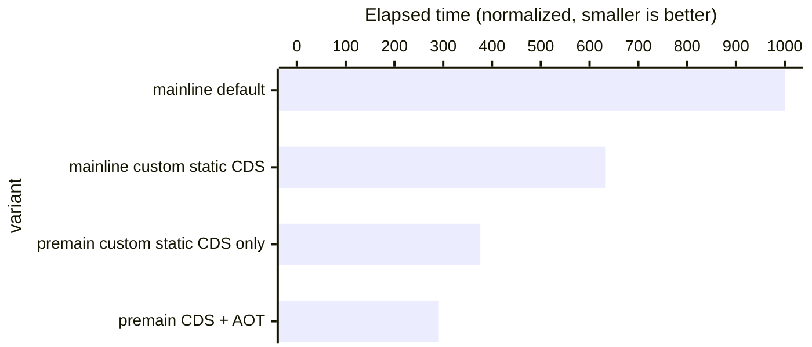
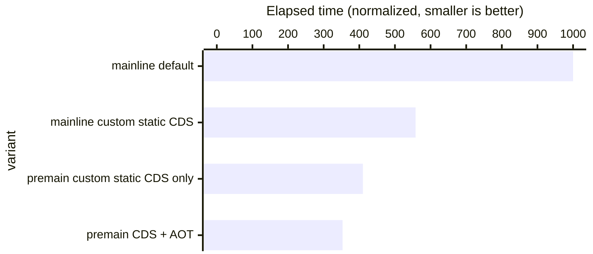
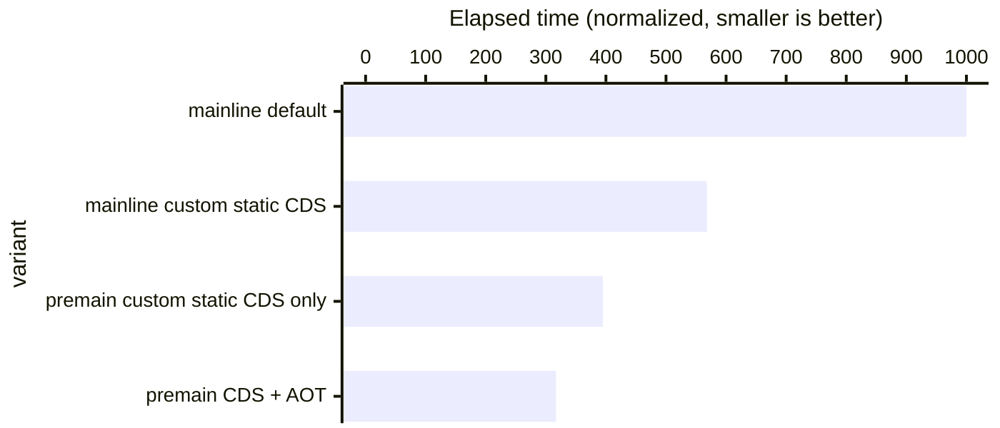
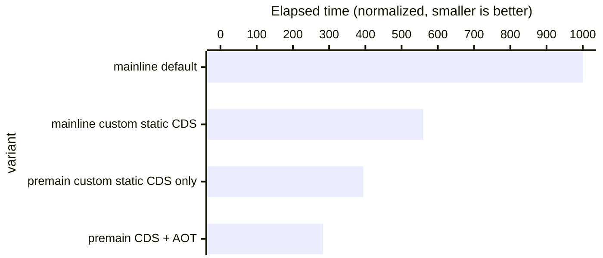
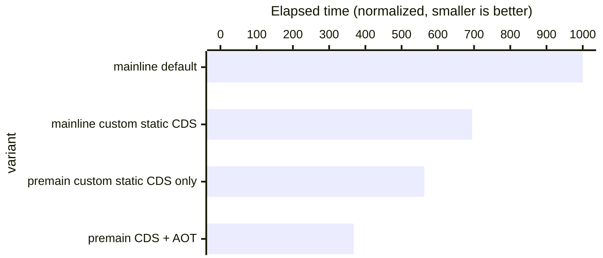

# Welcome to the Leyden Prototype Repository!

The purpose of the Leyden repository is to prototype improvements to the
startup time, time to peak performance, and footprint of Java programs, as a part of 
[Project Leyden](https://openjdk.org/projects/leyden). We solicit feedback from
the Java community, with the hope that some of these improvements can be eventually
incoporated in future JDK releases.

## 0. Disclaimers

- *This repository contains experimental and unstable code. It is not intended to be used
   in a production environment.*
- *This repository is intended for developers of the JDK, and advanced Java developers who
   are familiar with building the JDK.*
- *The experimental features in this repository may be changed or removed without notice.
   Command line flags and workflows will change.*
- *The benchmarks results reported on this page are for illustrative purposes only. Your
   applications may get better or worse results.*

## 1. Overview

The Leyden "[premain](https://github.com/openjdk/leyden/blob/premain/)" prototype
includes many optimizations that shift work from run time to earlier
executions of the application, which are
called _training runs_. In a training run, we pre-compute various kinds of information.
Importantly, we pre-compile
bytecode to native code, guided by observations of the application's actual behavior
during the training run.

The Leyden repository closely tracks the JDK main line. We are typically only a few weeks behind
the [main-line JDK repo](https://github.com/openjdk/jdk).

We have implemented the following improvements over the JDK main line:

- **[Ahead-of-Time Class Loading & Linking (JEP 483)](https://openjdk.org/jeps/483)**:
  This gives
  the JVM the ability to put classes in the _linked_ state as soon the application starts up. As a result,
  we can implement many other time shifting optimizations with considerably simplified assumptions.
  - This feature is accessed with the new VM flag `-XX:+PreloadSharedClasses`.

- **[Unified Ahead-of-Time Cache (JEP draft 8320264)](https://openjdk.org/jeps/8320264)**:
  This enhancement to [CDS] is foundational to the features that follow.
  - It enables [CDS] to store not only class metadata and heap objects (as before),
  but also profiling data and compiled code.
  - This feature is accessed with the new VM flag `-XX:CacheDataStore`.
  - This option simplifies the creation of the CDS archive, and also the testing
  of all the prototype features listed here.

- **[Ahead-of-Time Method Profiling (JEP draft 8325147)](https://openjdk.org/jeps/8325147)**: We store method profiles
  from training runs in the CDS archive, thereby enabling the JIT to begin compiling earlier during warmup.
  As a result, Java applications can reach peak performance faster.
  - This feature is enabled by the new VM flags `-XX:+RecordTraining` and `-XX:+ReplayTraining`.

- **Ahead-of-time resolution of constant pool entries**: many
  constant pool entries are resolved during the assembly phase. This allows the application to start up faster. Also,
  the existence of resolved constant pool entries allows the AOT compiler to generate better code.
  For diagnostic purposes, you can use `-XX:+UnlockDiagnosticVMOptions -XX:-AOTInvokeDynamicLinking`
  to disable the AOT linking of constant pool entries for the `invokedynamic` bytecode.

- **[Ahead-of-Time Code Compilation (JEP draft 8335368)](https://openjdk.org/jeps/8335368)**: Methods that are frequently used during the training run can be
  compiled and stored along with the CDS archive. As a result, as soon as the application starts up
  in the production run, its methods can be can be natively executed.
  - This feature is enabled by the new VM flags `-XX:+StoreCachedCode`, `-XX:+LoadCachedCode`, and `-XX:CachedCodeFile`.
  - Currently, the native code is stored in a separate file, but our plans is to eventually store the native code
    inside the CDS archive file.

- **Ahead-of-time generation of [Dynamic Proxies](https://docs.oracle.com/en/java/javase/22/docs/api/java.base/java/lang/reflect/Proxy.html)**:
  Dynamic proxies are frequently used by popular application frameworks. We can improve start-up time by generating these proxies ahead of time.
  - This feature is enabled by the new VM flag `-XX:+ArchiveDynamicProxies`.

- **Ahead-of-time generation of reflection data**: Reflection data (such as instances of
  `java.lang.reflect.Method`) are generated by the JVM to support `java.lang.reflect` operations. We can
  generate these ahead of time to improve start-up.
  - This feature is enabled by the new VM flag `-XX:+ArchiveReflectionData`.

- **Class Not Found Cache**: Sometimes application frameworks repeatedly try to load classes that do not exist. This optimization allows such failing lookups to be done quickly without repeatedly scanning the class path.
  - This feature is enabled by the new VM flag `-XX:+ArchiveLoaderLookupCache`.

The flag `-XX:CacheDataStore` automatically enables the whole bundle
of features listed above.  This simplifies testing of the whole
prototype.  If necessary for more detailed testing, each feature can
be individually disabled by negating its associated flag.

The names of all of these VM flags will change in a future EA build as we transition from the old “CDS” terminology to the new “AOT” terminology, as discussed [here](https://openjdk.org/jeps/483#History).

[CDS]: <https://docs.oracle.com/en/java/javase/22/vm/class-data-sharing.html>

## 2. Building the Leyden Repository

The Leyden Repository can be built in the same way as the main-line JDK repository.
Please use the "premain" branch. I.e., [https://github.com/openjdk/leyden/tree/premain](https://github.com/openjdk/leyden/tree/premain).

For build instructions please see the
[online documentation](https://openjdk.org/groups/build/doc/building.html),
or either of these files:

- [doc/building.html](doc/building.html) (html version)
- [doc/building.md](doc/building.md) (markdown version)

See <https://openjdk.org/> for more information about the OpenJDK
Community and the JDK and see <https://bugs.openjdk.org> for JDK issue
tracking.

## 3. Trying out Leyden Features

The easiest way to try out the Leyden features is to build a JVM from the Leyden repository, and use it with your application with the `-XX:CacheDataStore` flag.

Here's a small benchmark that uses the JDK's built-in
[`JavaCompiler`](https://docs.oracle.com/en/java/javase/21/docs/api/java.compiler/javax/tools/JavaCompiler.html)
class to compile some Java source files. This benchmark spends a significant amount of start-up time 
setting up the classes used by `JavaCompiler`, so it will benefit from the Leyden features.

First, download [JavacBenchApp.java](https://github.com/iklam/jdk/blob/f95f851aed3d2bf06edabab1e7c24e15f4145d0d/test/hotspot/jtreg/runtime/cds/appcds/applications/JavacBenchApp.java)
and compile it into a JAR file.

(Remember to use the `java` program that you built from the Leyden repository.)

```
$ javac JavacBenchApp.java
$ jar cvf JavacBenchApp.jar JavacBenchApp*.class
added manifest
adding: JavacBenchApp$ClassFile.class(in = 1608) (out= 787)(deflated 51%)
adding: JavacBenchApp$FileManager.class(in = 2090) (out= 979)(deflated 53%)
adding: JavacBenchApp$SourceFile.class(in = 1351) (out= 671)(deflated 50%)
adding: JavacBenchApp.class(in = 7571) (out= 3302)(deflated 56%)
```

We can run this benchmark without any Leyden features. It takes 893 ms:

```
$ java -cp JavacBenchApp.jar JavacBenchApp 50
Generated source code for 51 classes and compiled them in 893 ms
```

Now, we can perform a _training run_ and create the Leyden cache files.

<b>Note: Any files `JavacBenchApp.cds*` created by previous tests must
be deleted, before new ones are created.</b>:

```
$ rm -fv JavacBenchApp.cds*
$ java -XX:CacheDataStore=JavacBenchApp.cds -cp JavacBenchApp.jar JavacBenchApp 50
$ ls -l JavacBenchApp.cds*
-r--r--r-- 1 iklam iklam 30900224 May 20 19:21 JavacBenchApp.cds
-r--r--r-- 1 iklam iklam 16895736 May 20 19:21 JavacBenchApp.cds.code
```

Two files are created:

- `JavacBenchApp.cds`: This file contains classes, heap objects and profiling data harvested from the training run.
- `JavacBenchApp.cds.code`: This file contains AOT-compiled methods, optimized for the execution behaviors observed during the training run.
  (Data in this file will be merged into `JavacBenchApp.cds` in a future release.)

Now, we can make a _production run_ of the program with the cache files. It finishes in 423 ms, or more than twice as fast as
before.

```
$ java -XX:CacheDataStore=JavacBenchApp.cds -cp JavacBenchApp.jar JavacBenchApp 50
Generated source code for 51 classes and compiled them in 423 ms
```

By default, training runs end when the application terminates.  You have two other options to end training runs:

- -XX:AOTEndTrainingOnMethodEntry=<method1,method2,...>[,count=100]
- jcmd \<pid> AOT.end_training

Note that AOTEndTrainingOnMethodEntry uses the same format as CompileOnly and the default count is 1

### Optional VM Flags

When you create the file `JavacBenchApp.cds` with the flag `-XX:CacheDataStore`,
all of the other options described
in the [Overview](#1-overview) section above are enabled by default. This ensures that you can get all the optimizations
without specifying them individually.

For diagnostic purposes, you can selectively disable some of the options:

- The `-XX:+LoadCachedCode` and `-XX:+ReplayTraining` flags affect only the production run.
- All other options affect only the training run.

For example, you can disable the loading of the AOT code during the production run. Notice that the benchmark now
starts more slowly than it did when AOT code was loaded.

```
$ java -XX:CacheDataStore=JavacBenchApp.cds -XX:-LoadCachedCode -cp JavacBenchApp.jar JavacBenchApp 50
Generated source code for 51 classes and compiled them in 647 ms
```

You can also disable AOT compilation in the training run:

```
$ rm -fv JavacBenchApp.cds*
$ java -XX:CacheDataStore=JavacBenchApp.cds -XX:-StoreCachedCode -cp JavacBenchApp.jar JavacBenchApp 50
$ ls -l JavacBenchApp.cds*
-r--r--r-- 1 iklam iklam 30277632 May 20 20:05 JavacBenchApp.cds
```

Note that the file `JavacBenchApp.cds.code` is no longer created.

## 4. Limitations of the Leyden Prototype

When trying out the Leyden, please pay attention to the following limitations.

### The Same Garbage Collector Must be Used between Training and Production Runs

The CDS archive generated by the Leyden prototype includes machine instructions that are specific to
the garbage collector. We recommend that you explicitly specify the same collector during both
training and production runs. For example:

```
# training run
$ rm -fv JavacBenchApp.cds*
$ java -XX:CacheDataStore=JavacBenchApp.cds -XX:+UseSerialGC -cp JavacBenchApp.jar JavacBenchApp 50

# production run
$ java -XX:CacheDataStore=JavacBenchApp.cds -XX:+UseSerialGC -cp JavacBenchApp.jar JavacBenchApp 50
```

Otherwise, the CDS archive may not be loaded for the production run, leading to suboptimal performance.
For example, sometimes you may perform the training run on a large development host, and then use
a container to run the application in a small production node. In the following scenario, as the collector
is not explicitly specified, the VM will automatically pick G1 for the training run, and SerialGC for the
production run (due to its limited amount of memory):

```
# training run (uses G1 by default)
$ rm -fv JavacBenchApp.cds*
$ java -XX:CacheDataStore=JavacBenchApp.cds -cp JavacBenchApp.jar JavacBenchApp 50

# production run (uses SerialGC)
$ docker run --rm -v /repos/leyden/build/linux-x64/images/jdk:/jdk -v $(pwd):/test \
    --memory=1024m \
    container-registry.oracle.com/java/openjdk \
    bash -c 'cd /test; /jdk/bin/java -XX:CacheDataStore=JavacBenchApp.cds -cp JavacBenchApp.jar JavacBenchApp 50'
[0.001s][error][cds] CDS archive has preloaded classes. It cannot be used because GC used during dump time (G1)
                     is not the same as runtime (Serial)
[0.001s][error][cds] An error has occurred while processing the shared archive file.
[0.001s][error][cds] Unable to map shared spaces
Error occurred during initialization of VM
Unable to use shared archive.
```
### Only G1GC, SerialGC, ParallelGC, EpsilonGC are Supported

Currently, if you use any other garbage collector in combination with `-XX:CacheDataStore`, the VM will
exit with an error.

```
$ java -XX:+UseZGC -XX:CacheDataStore=foo --version
Error occurred during initialization of VM
Cannot create the CacheDataStore: UseCompressedClassPointers must be enabled, and collector
must be G1, Parallel, Serial, or Epsilon
```


### -Xshare:on is Enabled by default

As seen in the example immediately above, in the production run, if the CDS archive cannot be
used for any reason, the JVM will report an error and exit. This happens as if `-Xshare:on` was
specified in the command-line.

In the standard JDK, when the CDS archive cannot be used for any reason (for example, the
archive was created for a different version of the JDK), the application will
continue to run without using CDS.
This fall-back strategy ensures that the application will function correctly, though at a lower level of performance.

With the Leyden prototype, we have changed this fall-back behavior to make it easier to diagnose
performance issues. For example, when the start-up time is not as good as one would expect, we
want know whether it's caused by a misconfiguration that prevents the CDS archive
from being used, or it's caused by a deficiency in the implementation of the Leyden optimizations.

To revert to the behavior of the standard JDK, you can explicitly add `-Xshare:auto` to the command-line.

```
$ docker run --rm -v /repos/leyden/build/linux-x64/images/jdk:/jdk -v $(pwd):/test \
    --memory=1024m \
    container-registry.oracle.com/java/openjdk \
    bash -c 'cd /test; /jdk/bin/java -Xshare:auto -XX:CacheDataStore=JavacBenchApp.cds -cp JavacBenchApp.jar JavacBenchApp 50'
[0.001s][error][cds] CDS archive has preloaded classes. It cannot be used because GC used during dump time (G1)
                     is not the same as runtime (Serial)
Generated source code for 51 classes and compiled them in 831 ms
```

See [here](https://docs.oracle.com/en/java/javase/21/vm/class-data-sharing.html) for a discussion of `-Xshare:on` vs  `-Xshare:auto`.


## 5. Benchmarking

We use a small set of benchmarks to demonstrate the performance of the optimizations in the Leyden repo.

| Benchmark  | Source |
| ------------- | ------------- |
|[helidon-quickstart-se](test/hotspot/jtreg/premain/helidon-quickstart-se) | https://helidon.io/docs/v4/se/guides/quickstart|
|[micronaut-first-app](test/hotspot/jtreg/premain/micronaut-first-app) | https://guides.micronaut.io/latest/creating-your-first-micronaut-app-maven-java.html|
|[quarkus-getting-started](test/hotspot/jtreg/premain/quarkus-getting-started) | https://quarkus.io/guides/getting-started|
|[spring-boot-getting-started](test/hotspot/jtreg/premain/spring-boot-getting-started) | https://spring.io/guides/gs/spring-boot|
|[spring-petclinic](test/hotspot/jtreg/premain/spring-petclinic) | https://github.com/spring-projects/spring-petclinic|

*(FIXME: add a benchmark for javac)*

### Benchmarking Against JDK Main-line

To can compare the performance of Leyden vs the main-line JDK, you need:

- An official build of JDK 21
- An up-to-date build of the JDK main-line
- The latest Leyden build
- Maven (ideally 3.8 or later, as required by some of the demos). Note: if you are behind
  a firewall, you may need to [set up proxies for Maven](https://maven.apache.org/guides/mini/guide-proxies.html)

The same steps are used for benchmarking all of the above demos. For example:

```
$ cd helidon-quickstart-se
$ make PREMAIN_HOME=/repos/leyden/build/linux-x64/images/jdk \
       MAINLINE_HOME=/repos/jdk/build/linux-x64/images/jdk \
       BLDJDK_HOME=/usr/local/jdk21 \
       bench
run,mainline default,mainline custom static CDS,premain custom static CDS only,premain CDS + AOT
1,398,244,144,107
2,387,247,142,108
3,428,238,143,107
4,391,252,142,111
5,417,247,141,107
6,390,239,139,127
7,387,247,145,111
8,387,240,147,110
9,388,242,147,108
10,400,242,167,108
Geomean,397.08,243.76,145.52,110.26
Stdev,13.55,4.19,7.50,5.73
Markdown snippets in mainline_vs_premain.md
```

The above command runs each configuration 10 times, in an interleaving order. This way
the noise of the system (background processes, thermo throttling, etc) is more likely to
be spread across the different runs.

As is typical for benchmarking start-up performance, the numbers are not very steady.
It is best to plot
the results (as saved in the file `mainline_vs_premain.csv`) in a spreadsheet to check for
noise and other artifacts.

The "make bench" target also generates GitHub markdown snippets (in the file `mainline_vs_premain.md`) for creating the
graphs below.

### Benchmarking Between Two Leyden Builds

This is useful for Leyden developers to measure the benefits of a particular optimization.
The steps are similar to above, but we use the "make compare_premain_builds" target:

```
$ cd helidon-quickstart-se
$ make PM_OLD=/repos/leyden_old/build/linux-x64/images/jdk \
       PM_NEW=/repos/leyden_new/build/linux-x64/images/jdk \
       BLDJDK_HOME=/usr/local/jdk21 \
       compare_premain_builds
Old build = /repos/leyden_old/build/linux-x64/images/jdk with options
New build = /repos/leyden_new/build/linux-x64/images/jdk with options
Run,Old CDS + AOT,New CDS + AOT
1,110,109
2,131,111
3,118,115
4,110,108
5,117,110
6,114,109
7,110,109
8,118,110
9,110,110
10,113,114
Geomean,114.94,110.48
Stdev,6.19,2.16
Markdown snippets in compare_premain_builds.md
```

Please see [test/hotspot/jtreg/premain/lib/Bench.gmk](test/hotspot/jtreg/premain/lib/Bench.gmk) for more details.

Note: due to the variability of start-up time, the benefit of minor improvements may
be difficult to measure.

### Preliminary Benchmark Results

The following charts show the relative start-up performance of the Leyden/Premain branch vs
the JDK main-line.

For example, a number of "premain CDS + AOT : 291" indicates that if the application takes
1000 ms to start-up with the JDK main-line, it takes only 291 ms to start up when all the
current set of Leyden optimizations for CDS and AOT are enabled.

The benchmark results are collected with `make bench` in the following directories:

- `helidon-quickstart-se`
- `micronaut-first-app`
- `quarkus-getting-started`
- `spring-petclinic`

These JDK versions were used in the comparisons:

- JDK main-line: https://github.com/openjdk/jdk/commit/70944ca54ad0090c734bb5b3082beb33450c4877
- Leyden: https://github.com/openjdk/leyden/commit/9fa972214934d30f67db5fd4d1b8007636ac1428

The benchmarks were executed on an 8-core Intel i7-10700 CPU @ 2.90GHz with 32GB RAM running Ubuntu 22.04.3 LTS.

### Helidon Quick Start (SE) Demo (3.44x improvement)



### Micronaut First App Demo (2.83x improvement)



### Quarkus Getting Started Demo (3.15x improvement)



### Spring-boot Getting Started Demo (3.53x improvement)



### Spring PetClinic Demo (2.72x improvement)



## 6. More Documentation

Please see [test/hotspot/jtreg/premain/](test/hotspot/jtreg/premain) for more information.
