We use a small set of benchmarks to demonstrate the performance of the optimizations in the Leyden repo.

| Benchmark  | Source |
| ------------- | ------------- |
|[helidon-quickstart-se](helidon-quickstart-se) | https://helidon.io/docs/v4/se/guides/quickstart|
|[javac-bench](javac_bench) | Using Javac to compile 50 source files |
|[micronaut-first-app](micronaut-first-app) | https://guides.micronaut.io/latest/creating-your-first-micronaut-app-maven-java.html|
|[quarkus-getting-started](quarkus-getting-started) | https://quarkus.io/guides/getting-started|
|[spring-boot-getting-started](spring-boot-getting-started) | https://spring.io/guides/gs/spring-boot|
|[spring-petclinic](spring-petclinic) | https://github.com/spring-projects/spring-petclinic|

### Benchmarking Against JDK Main-line

To can compare the performance of Leyden vs the main-line JDK, you need:

- An official build of JDK 21
- An up-to-date build of the JDK main-line
- The latest Leyden build
- Maven (ideally 3.8 or later, as required by some of the demos). Note: if you are behind
  a firewall, you may need to [set up proxies for Maven](https://maven.apache.org/guides/mini/guide-proxies.html)

The same steps are used for benchmarking all of the above demos. For example:

```
$ cd helidon-quickstart-se
$ make PREMAIN_HOME=/repos/leyden/build/linux-x64/images/jdk \
       MAINLINE_HOME=/repos/jdk/build/linux-x64/images/jdk \
       BLDJDK_HOME=/usr/local/jdk21 \
       bench
run,mainline default,mainline custom static cds,mainline aot cache,premain aot cache
1,253,137,71,54
2,267,129,67,56
3,256,130,70,56
4,249,132,70,55
5,252,133,70,56
6,257,132,73,55
7,261,136,71,55
8,253,129,74,58
9,255,131,107,53
10,260,139,74,53
Geomean,256.25,132.76,74.05,55.08 (4.65x improvement)
Stdev,4.96,3.28,10.95,1.45
Markdown snippets in mainline_vs_premain.md
```

The above command runs each configuration 10 times, in an interleaving order. This way
the noise of the system (background processes, thermo throttling, etc) is more likely to
be spread across the different runs.

As is typical for benchmarking start-up performance, the numbers are not very steady.
It is best to plot
the results (as saved in the file `mainline_vs_premain.csv`) in a spreadsheet to check for
noise and other artifacts.

The "make bench" target also generates GitHub markdown snippets (in the file `mainline_vs_premain.md`) for creating the
graphs below.

### Preliminary Benchmark Results

The following charts show the relative start-up performance of the leyden/premain2 branch vs
the JDK main-line.

For example, a number of "premain aot cache: 255" indicates that if the application takes
1000 ms to start-up with the JDK main-line, it takes only 255 ms to start up when all the
current set of Leyden optimizations are enabled.

The benchmark results are collected with `make bench` in the following directories:

- `helidon-quickstart-se`
- `javac-bench`
- `micronaut-first-app`
- `quarkus-getting-started`
- `spring-boot-getting-started`
- `spring-petclinic`

The meaning of the four rows in the following charts:

| Row  | Meaning |
| ------------- | ------------- |
| **mainline default**            |Run benchmark with no optimizations|
| **mainline custom static cds**  |Run benchmark with a custom static CDS archive|
| **mainline aot cache**          |Run benchmark with a custom AOT cache (JDK mainline)|
| **premain aot cache**           |Run benchmark with a custom AOT cache (Leyden Premain Prototype)|

We have benchmark results from two types of configurations using the
script [bench_data/do_bench.sh](bench_data/do_bench.sh):

- Desktop/Server Class: these are the results when running on a modern desktop or server, using the
  command `bash bench_data/do_bench.sh`.
- 2 Cores Only: these are the results when running in a limited configuration where only two cores.
  are available, using the command `taskset -c 1,2 bash bench_data/do_bench.sh`

The 2 Cores Only setting is intended to emulate microservice configurations where a very small number
of cores are allocated for small Java programs. In this setting, the JIT compiler may compete for CPU
with the Java program, making start-up slower. The **premain aot cache** numbers usually are much better in
this setting because most of the start-up code has been AOT-compiled, so the app can spend most of the
available CPUs to execute application logic.

These JDK versions were used in the comparisons:

- JDK main-line: https://github.com/openjdk/jdk/tree/2365ecc5fd83cf27c6c55aaca5aa6bad6ae9dbbf
- Leyden: https://github.com/openjdk/leyden/tree/ce150637130086ad2b47916d66148007f5331a28

For details information about the hardware and raw numbers, see [bench.20260929.txt](bench_data/bench.20260929.txt)
 and [bench.20260929-2cpu.txt](bench_data/bench.20260929-2cpu.txt)

#### Premain AOT Cache Summary

This is the speed up of **premain aot cache** vs **mainline default** in the two types of configurations

| Benchmark | Desktop/Server Class (28 Cores) | 2 Cores Only|
|:-------------|-------------:| -------------:|
| Helidon Quick Start | 3.59x | 4.11x |
| JavacBenchApp 50 source files | 2.21x | 3.17x |
| Micronaut First App Demo | 2.91x | 4.90x |
| Quarkus Getting Started Demo | 2.97x | 3.74x |
| Spring-boot Getting Started Demo | 4.13x | 4.70x |
| Spring PetClinic Demo | 3.33x | 3.03x |

### 5.1 Benchmark Results - Desktop/Server Class (28 Cores)

#### Helidon Quick Start (3.59x improvement - Desktop/Server Class (28 Cores))

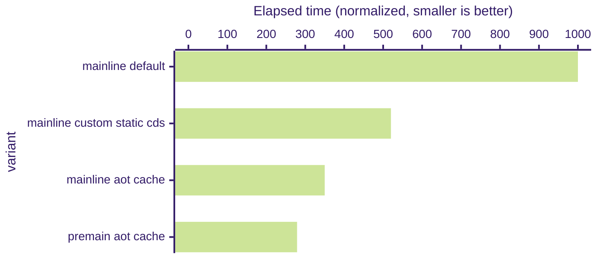

#### JavacBenchApp 50 source files (2.21x improvement - Desktop/Server Class (28 Cores))

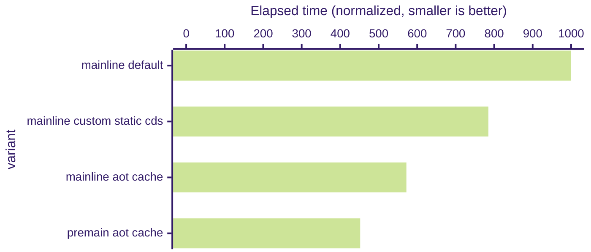

#### Micronaut First App Demo (2.91x improvement - Desktop/Server Class (28 Cores))

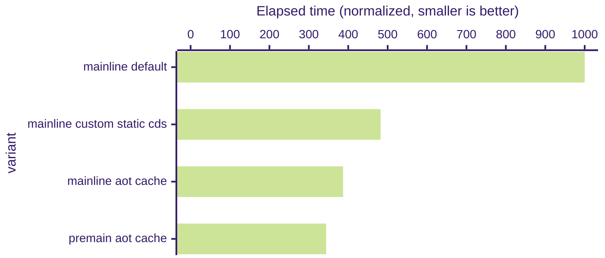

#### Quarkus Getting Started Demo (2.97x improvement - Desktop/Server Class (28 Cores))

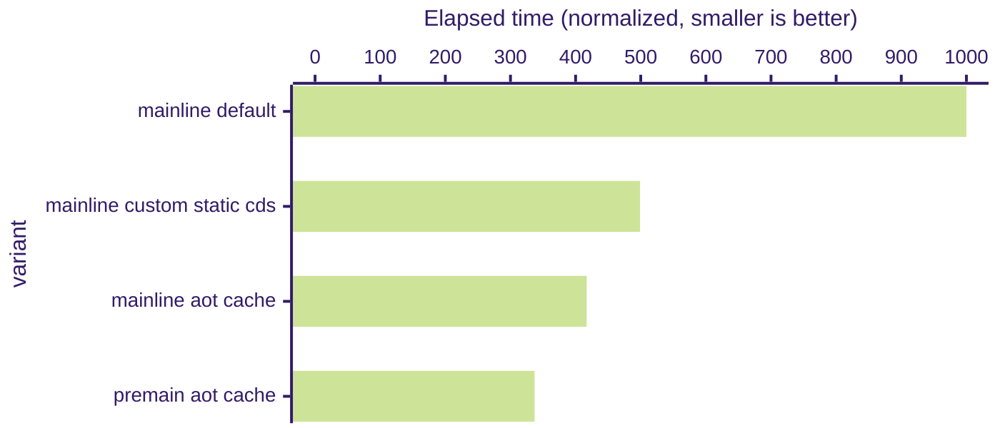

#### Spring-boot Getting Started Demo (4.13x improvement - Desktop/Server Class (28 Cores))

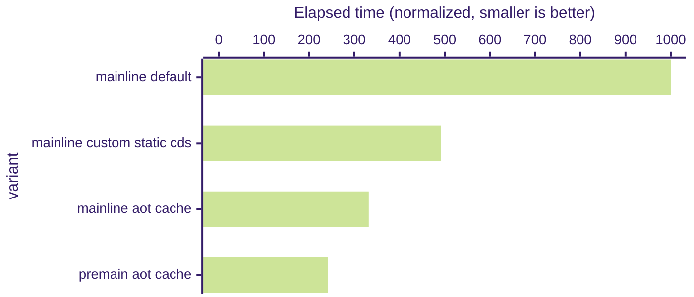

#### Spring PetClinic Demo (3.33x improvement - Desktop/Server Class (28 Cores))


### 5.2 Benchmark Results - 2 Cores Only

#### Helidon Quick Start (4.11x improvement - 2 Cores Only)

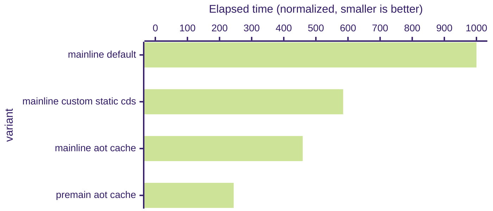

#### JavacBenchApp 50 source files (3.17x improvement - 2 Cores Only)

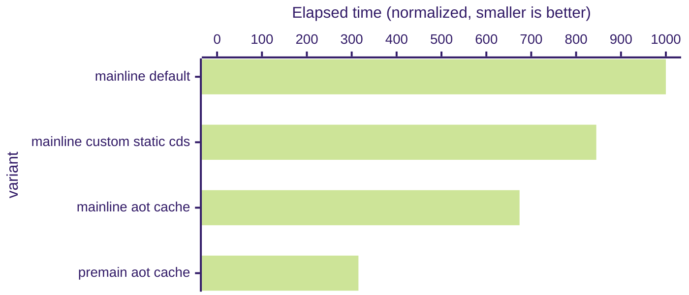

#### Micronaut First App Demo (4.90x improvement - 2 Cores Only)

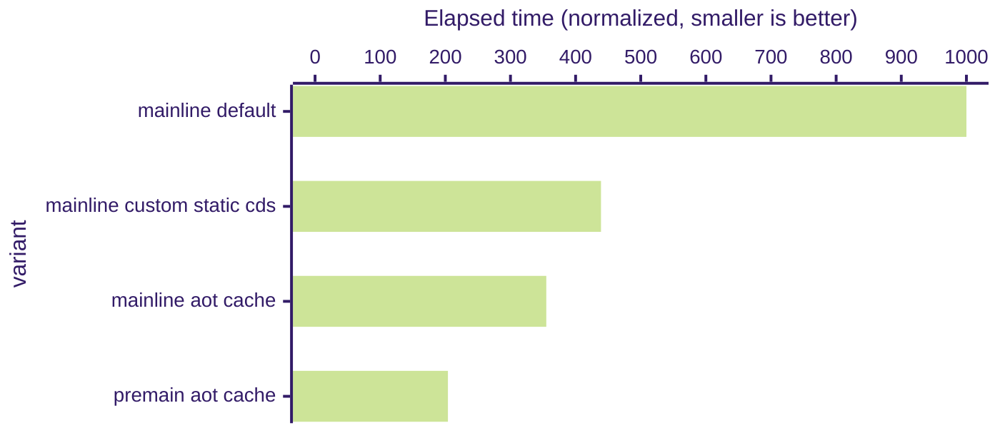

#### Quarkus Getting Started Demo (3.74x improvement - 2 Cores Only)

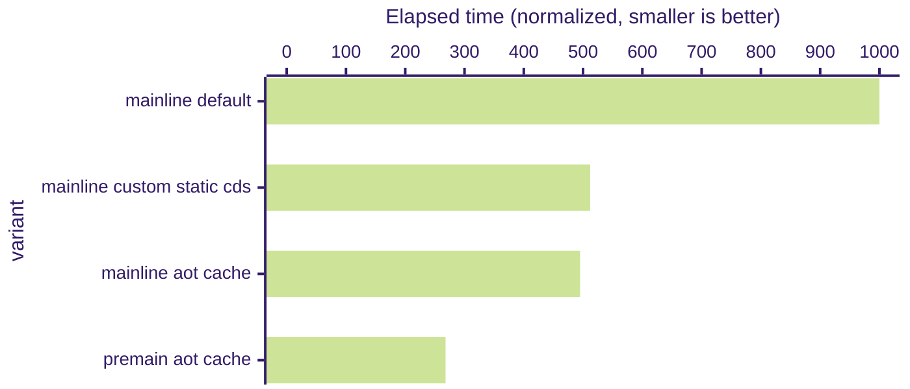

#### Spring-boot Getting Started Demo (4.70x improvement - 2 Cores Only)

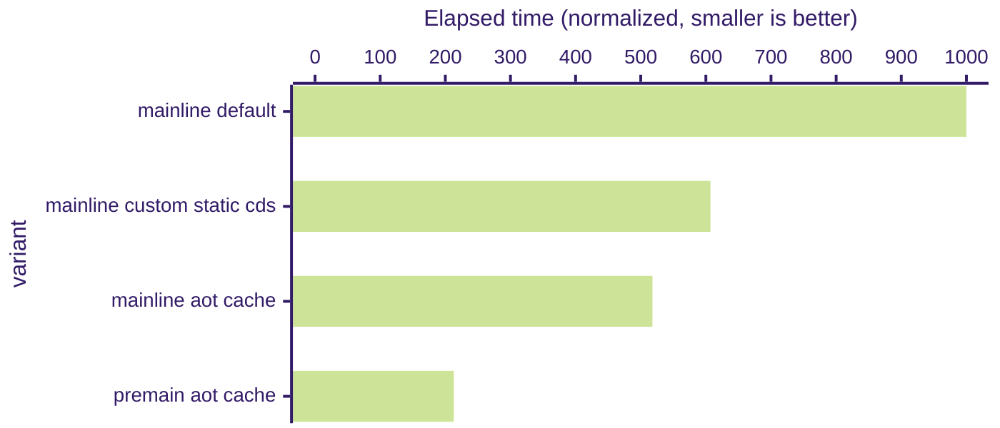

#### Spring PetClinic Demo (3.03x improvement - 2 Cores Only)

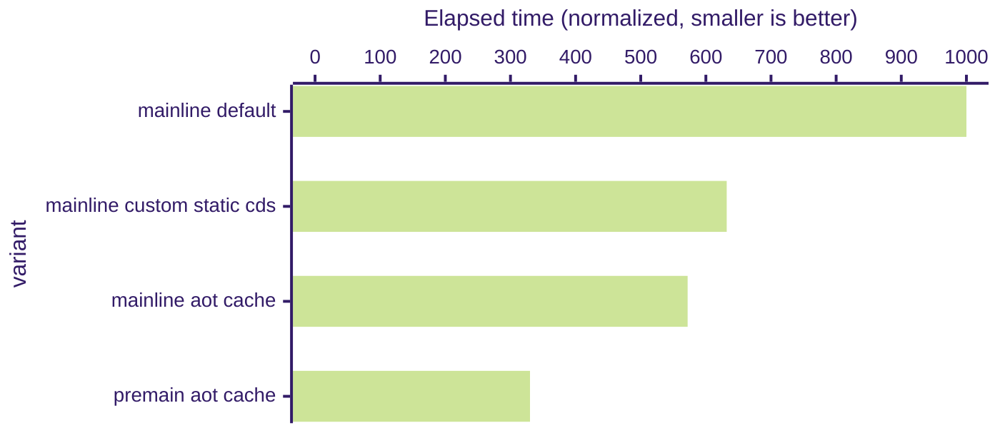
