# Demos and Documentation for Leyden-premain Protype

## Demos

- [simple](simple) script to demonstrate the "5 step" process of training/production run with leyden-premain prototype

- [jmh](jmh) run JMH + specjbb2005-jmh-1.25.jar

- [javac](javac) using javac as a regression test, to compile up to 10000 Java source files

- [javac_helloworld](javac_helloworld) measures the total elapsed time of `javac HelloWorld.java` using
the premain branch vs the JDK mainline.
It's a good demonstration of how we can improve start-up time of a complex application.

- [javac_new_workflow](javac_new_workflow) Example of the new "one step training" workflow
(still under development) where you can generate all the Leyden artifacts with a single
JVM invocation.

## Docs

- [InvokeDynamic.md](InvokeDynamic.md) CDS optimizations for invokedynamic

## Preliminary Benchmark Results

The following charts show the relative start-up performance of the Leyden/Premain branch vs
the JDK mainline.

For example, a number of "premain CDS + AOT : 291" indicates that if the application takes
1000 ms to start-up with the JDK mainline, it takes only 291 ms to start up when all the
current set of Leyden optimizations for CDS and AOT are enabled.

The benchmark results are collected with `make bench` in the following directories:

- helidon-quickstart-se
- micronaut-first-app
- quarkus-getting-started
- spring-petclinic

The version used in the comparisons:

- JDK Mainline: https://github.com/openjdk/jdk/commit/70944ca54ad0090c734bb5b3082beb33450c4877
- Leyden: https://github.com/openjdk/leyden/commit/9fa972214934d30f67db5fd4d1b8007636ac1428

### Helidon Quick Start (SE) Demo

```mermaid
gantt
    title Elapsed time (normalized, smaller is better)
    todayMarker off
    dateFormat  X
    axisFormat %s

    mainline default   : 0, 1000
    mainline custom static CDS   : 0, 632
    premain custom static CDS only   : 0, 376
    premain CDS + AOT   : 0, 291
```

### Micronaut First App Demo

```mermaid
gantt
    title Elapsed time (normalized, smaller is better)
    todayMarker off
    dateFormat  X
    axisFormat %s

    mainline default   : 0, 1000
    mainline custom static CDS   : 0, 558
    premain custom static CDS only   : 0, 410
    premain CDS + AOT   : 0, 353
```

### Quarkus Getting Started Demo

```mermaid
gantt
    title Elapsed time (normalized, smaller is better)
    todayMarker off
    dateFormat  X
    axisFormat %s

    mainline default   : 0, 1000
    mainline custom static CDS   : 0, 568
    premain custom static CDS only   : 0, 395
    premain CDS + AOT   : 0, 317
```

### Spring PetClinic Demo

```mermaid
gantt
    title Elapsed time (normalized, smaller is better)
    todayMarker off
    dateFormat  X
    axisFormat %s

    mainline default   : 0, 1000
    mainline custom static CDS   : 0, 695
    premain custom static CDS only   : 0, 563
    premain CDS + AOT   : 0, 368
```

